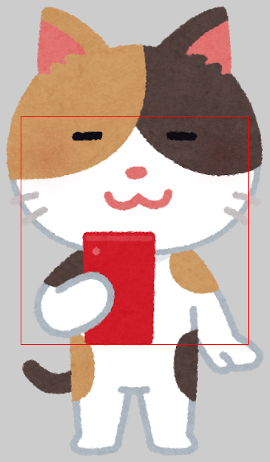

# ImageView ScaleType Showcase

A sample application to check the effects of ImageView's ScaleTypes

# Capture screenshots

- Capturing screenshots is implemented as instrumentation test with [facebook/screenshot-tests-for-android](https://github.com/facebook/screenshot-tests-for-android)
- Screenshots can be captured with connected Android device or Android emulator by `gradlew runDebugAndroidTestScreenshotTest` command
  - Screenshots are automatically copied to [`app/screenshots`](./app/screenshots) directory

# Summary of ScaleTypes

| `ScaleType` | Larger image | Medium image | Smaller image | Aspect ratio | Scaling |
| --- | :-: | :-: | :-: | :-: | :-: |
| (ImageView & drawable sizes) |  |  |  | | |
| [`CENTER`](https://developer.android.com/reference/android/widget/ImageView.ScaleType#CENTER) |  |  |  | Maintained | N |
| [`FIT_CENTER`](https://developer.android.com/reference/android/widget/ImageView.ScaleType#FIT_CENTER) |  |  |  | Maintained | Y |
| [`CENTER_CROP`](https://developer.android.com/reference/android/widget/ImageView.ScaleType#CENTER_CROP) |  |  |  | Maintained | Y |
| [`CENTER_INSIDE`](https://developer.android.com/reference/android/widget/ImageView.ScaleType#CENTER_INSIDE) |  |  |  | Maintained | Y (shrinking only) |
| [`FIT_XY`](https://developer.android.com/reference/android/widget/ImageView.ScaleType#FIT_XY) |  |  |  | May changed | Y |
| [`FIT_START`](https://developer.android.com/reference/android/widget/ImageView.ScaleType#FIT_START) |  |  |  | Maintained | Y |
| [`FIT_END`](https://developer.android.com/reference/android/widget/ImageView.ScaleType#FIT_END) |  |  |  | Maintained | Y |